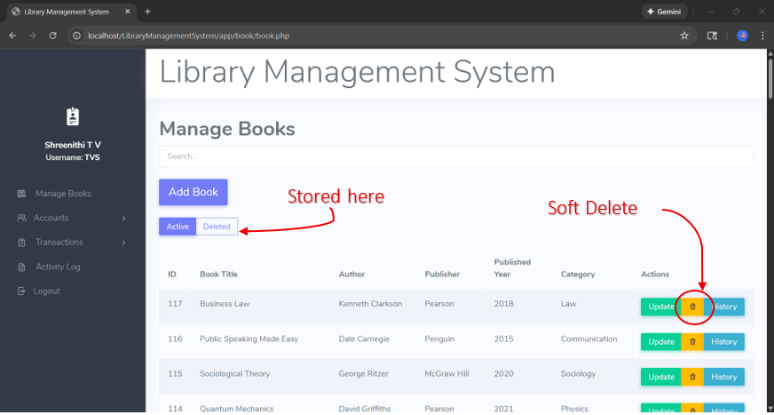
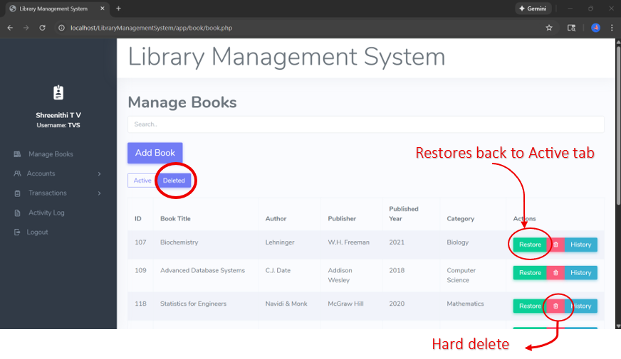
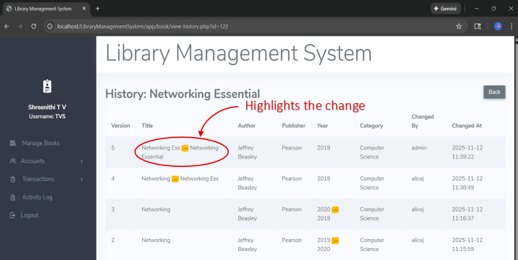
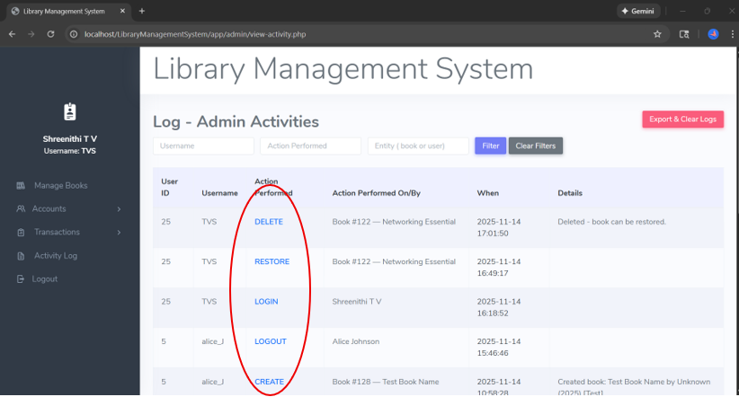

# 📚 Library Management System  
### Software Maintenance · QA Validation · PHP · MySQL

---

## 🔍 Overview

This project is a **PHP-MySQL Library Management System** enhanced with software maintenance and quality-focused features.

The main focus is not just CRUD operations, but also:

- backend validation
- regression testing
- soft delete and restore workflows
- version history tracking
- admin activity logging
- data integrity and traceability

---

## ✨ Key Features

| Feature | Description |
|---|---|
| 📖 Book Management | Add, update, search, and manage books |
| 🗑️ Soft Delete | Moves deleted books into a deleted records tab |
| ♻️ Restore | Restores deleted books back to active records |
| ❌ Hard Delete | Permanently removes deleted records |
| 🕘 Version History | Tracks changes made to book records |
| 🟨 Change Highlighting | Highlights modified values in history |
| 🧾 Activity Log | Records admin actions like create, delete, restore, login, and logout |

---

## 🖼️ Screenshots

### Active Books + Soft Delete

---

### Deleted Books + Restore / Hard Delete

---

### Version History with Highlighted Changes

---

### Admin Activity Log

---

## 🧪 QA / Testing Focus

| Area Tested | Validation Goal |
|---|---|
| Add Book | Book should be saved and displayed correctly |
| Update Book | Updated values should appear in the system |
| Soft Delete | Book should move from Active to Deleted tab |
| Restore | Deleted book should return to Active tab |
| Hard Delete | Book should be permanently removed |
| Version History | Changes should be tracked correctly |
| Activity Log | Admin actions should be recorded |
| Regression Testing | Existing workflows should still work after updates |

---

## ✅ Example QA Workflow

1. Add a new book record.
2. Verify it appears under the **Active** tab.
3. Update book details.
4. Check **History** to confirm the change is tracked.
5. Soft delete the book.
6. Verify it moves to the **Deleted** tab.
7. Restore the book.
8. Confirm it returns to the **Active** tab.
9. Delete again and perform hard delete.
10. Verify the action appears in the **Activity Log**.

---

## 🛠️ Tech Stack

| Category | Tools / Context |
|---|---|
| Frontend | HTML, CSS, Bootstrap |
| Backend | PHP |
| Database | MySQL |
| Local Server | XAMPP / Apache |
| Development Environment | Localhost, phpMyAdmin, Browser Testing |
| Testing Focus | Functional Testing, Smoke Testing, Regression Testing, Backend Validation |

---

## 👩‍💻 My Role

I worked solo on maintaining and improving an existing GitHub-based Library Management System project.

My focus was on:

- understanding the existing PHP-MySQL codebase
- making maintenance-focused feature changes
- validating backend CRUD workflows
- testing soft delete, restore, and hard delete behavior
- verifying version history and activity logs
- checking database consistency through phpMyAdmin
- supporting regression and smoke testing after changes

---

## 🚀 How to Run Locally

1. Clone this repository.

   `git clone https://github.com/SHREENITHI-TV/Library-Management-System-Software-Maintenance.git`

2. Move the project folder into your XAMPP `htdocs` folder.

3. Start **Apache** and **MySQL** from XAMPP.

4. Open phpMyAdmin.

   `http://localhost/phpmyadmin`

5. Import the project database file if provided.

6. Open the project in your browser.

   `http://localhost/LibraryManagementSystem/`

---

## 📌 Project Relevance

This project demonstrates practical experience in:

- software maintenance
- backend validation
- regression testing
- CRUD workflow verification
- SQL-backed data checks
- defect verification
- activity logging and traceability

---

### Built with a focus on reliability, maintainability, and software quality.

